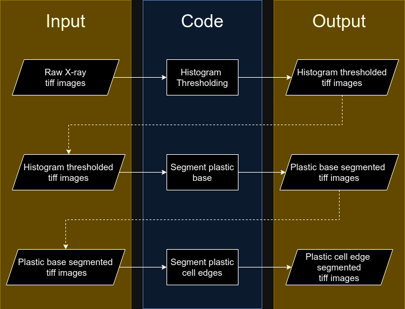

# Honeycomb analysis
A repository to _analyze adaptive strategies that honeybees use in building honeycomb under varying cell size initiations_ at the Peleg lab @ CU Boulder.

## Setup

Firstly, clone this repository.

### Dependencies
It is highly recommended that you set up a `python` virtual environment before running the following package installation commands. To do so, follow the instructions outlined [here](https://packaging.python.org/en/latest/guides/installing-using-pip-and-virtual-environments/#create-and-use-virtual-environments). Once you have created a `python` virtual environment for this project and activated it, run the following package installation commands **from within the virtual environment**.

Install the necessary `python` packages by running the following command from the root of the repository.
```
pip install -r requirements.txt
```
This project uses [OpenCV](https://opencv.org/) to perform some image processing operations on the data. To use OpenCV on `python`, the `cv2` package has to be installed. Install this package as follows:
```
pip install opencv-contrib-python
```
For more details about installing OpenCV for `python`, go [here](https://github.com/opencv/opencv-python).

In case OpenCV fails to install properly using this method, there is an alternative way to install OpenCV for `python` by compiling it from the source. Although this is a time-consuming procedure, it is the officially recommended way to install OpenCV for `python`. Instructions to do this can be found here - [Windows](https://pyimagesearch.com/2022/04/25/installing-opencv-on-windows/), [Ubuntu](https://pyimagesearch.com/2018/08/15/how-to-install-opencv-4-on-ubuntu/), [MacOS](https://pyimagesearch.com/2018/08/17/install-opencv-4-on-macos/).

## Image data preprocessing
Run this only if you intend to customize the image processing pipeline. Otherwise, it is **highly recommended** to skip this section and move directly to the statistical analysis as the image processing pipeline takes a considerable amount of time to run, even for a single dataset.

To inspect the processed data, say in a 3D image processing software like [Dragonfly](https://dragonfly.comet.tech/), download the processed data from our [dryad depository](https://doi.org/10.5061/dryad.z8w9ghxmw), under `processed_XRM_data.zip`. The raw data is available in our dryad as well, and its location is specified in the next section.

The objective of the image processing pipeline in this repository is to transform the raw X-ray microscopy data into a form that is more amenable to visualization and further analysis. To this end, the code in this repo processes the `TIFF` image stack obtained from X-ray microscopy. The image processing is divided into three main stages, which are explained below:
* **Histogram Thresholding:** In this step, the raw X-ray microscopy `TIFF` images in a dataset are processed to filter out pixels corresponding to air (background), leaving only those pixels corresponding to honeycomb and plastic (foreground).
* **Plastic base segmentation:** In this step, the histogram thresholded images are processed to filter out the plastic starter base, leaving only the honeycomb and plastic cell edges.
* **Plastic cell edges segementation:** In this step, the resultant images from the previous step are processed to segement cell edges for visualization purposes.

An elaborate account of these processing stages in provided in the SI for the paper.

The code is organized so that each of these stages can be run separately on the desired dataset. A visual schematic of the code flow is provided below:



### Data
Download the raw data from the [dryad depository](https://doi.org/10.5061/dryad.z8w9ghxmw) associated with this work. The raw data files are named `s_xxx_xrm_data.zip`, `xxx` indicating the construction mode. E.g., `s_1_raw_xrm_data.zip` for `S=1`, `s_o75_raw_xrm_data.zip` for `S=0.75` etc.

Once downloaded, extract the contents of the compressed `.zip` archive. The archive should contain a set of `.tiff` images. Move these images into the corresponding directory under `data-processing/input/`. For instance, for the `S=1` construction mode, you would extract the contents of `s_1_raw_xrm_data.zip` and place the extracted `.tiff` files in the directory  `data-processing/input/s_1`.

### Running the processing code

Once the data has been extracted and placed into its corresponding input directory, run the cells of the notebook `data-processing/notebooks/honeycomb-analysis.ipynb`.

The results of data processing for each dataset are stored within _subdirectories_ under the main input directory for that dataset. These subdirectories are named after the step of the image processing pipeline that produces them. For instance, if you run the _histogram thresholding_ step of the image processing pipeline on the `S=1` data stored under `data-processing/input/s_1/`, the results of this operation are stored in the subdirectory `data-processing/input/s_1/hist_threshold/`.

Once the entire notebook is run, you will find the fully processed data under the `plastic_segmented` subdirectory under the main input directory for each dataset that the notebook is run on. For instance, once the entire notebook is run for the `S=1` data stored under `data-processing/input/s_1/`, the final processed images for this data are stored in the subdirectory `data-processing/input/s_1/plastic_segmented/`.

The following table outlines each image preprocessing step and its corresponding result output subdirectory:

| **Image preprocessing step** | **Output subdirectory name** |
| --- | --- |
| Histogram thresholding | `hist_threshold` |
| Plastic base filtering | `plastic_base_masked` |
| Segment plastic cell edges  | `plastic_segmented` |

## Angle computation from Dragonfly measurements


## Statistical analysis

This section contains details about preparing the data and running the statistical analysis that produce the results cited in the paper.

### Data

#### S=0.75 covered cell data
This data contains the covered cell data for the `S=0.75` construction mode and can be found under `s_o75_covered_cell_data.zip` in our [dryad depository](https://doi.org/10.5061/dryad.z8w9ghxmw). Download this `.zip` file and extract its contents into `statistical-analysis/input/o75-covered-cells-data/`.

After the contents of the `.zip` file have been extracted, the directory `statistical-analysis/input/o75-covered-cells-data/` should contain the following `CSV` files:
- `covered_cells_o75_1.csv`
- `covered_cells_o75_2.csv`
- `covered_cells_o75_3.csv`

where, each `CSV` file contains data about the covered/non-covered cell count for one replicate in this construction mode.
<!-- These `CSV` files are organized as follows:

| **Row number** | **Covered** | **All** |
| --- | --- | --- |
| 1 | m1 | n1 |
| 2 | m2 | n2 |
| ... | ... | ... | -->

To estimate the proportion of covered cells in a `S=0.75` frame, we manually count the number of printed cells that are covered and the total number of printed cells in each row of hexagons on the experimental frame. As a result, the covered cell data is recorded at the resolution of a row on the experimental frame and the `CSV` files contain the following columns:

| **Column name** | **Description** |
| --- | --- |
| Row number | _Serial number of the row on the experimental frame_ |
| Covered | _Count of covered printed cells in that row_ |
| All | _Count of the total number of printed cells in that row_ |

#### Cell-size data
The cell-size data for each construction mode is a set of `CSV` files, where each `CSV` file stores the cell-size data for one replicate (frame) of that construction mode. In our data, we have 3-4 replicates per construction mode. Download `cell-size-data.zip` from the [dryad depository](https://doi.org/10.5061/dryad.z8w9ghxmw) and unzip this archive under `statistical-analysis/input/cell-size-data`.

To verify that the files are placed into the correct hierarchy of directories, check that `statistical-analysis/input/cell-size-data/cell-size-data` has 7 subdirectories:
- `S_1`
- `S_1o25`
- `S_1o5`
- `S_1o75`
- `S_2`
- `S_3`
- `S_o75`

Each of these subdirectories should have multiple `CSV` files. For instance, `statistical-analysis/input/cell-size-data/cell-size-data/S_1/` should have 4 `CSV` files:
- `S_1`
    - `s_1_cell_sizes_1.csv`
    - `s_1_cell_sizes_2.csv`
    - `s_1_cell_sizes_3.csv`
    - `s_1_cell_sizes_4.csv`
    
where, each `CSV` file contains the cell-size data for one replicate of the `S=1` construction mode. The cell-size (area in $mm^2$) of each individual cell in the experimental frame is recorded and as a result, the `CSV` files contain the following columns:

| **Column name** | **Description** |
| --- | --- |
| cx | _X-coordinate of the center of the cell_ |
| cy | _Y-coordinate of the center of the cell_ |
| area_mm2 | _Area of that cell in_ $mm^2$ |

#### Angle-of-tilt data

- ##### Computing angle of tilt from 3D honeycomb X-ray data (can be skipped)

    This subsection is documented **for the sake of completeness**, and **can be skipped** as it is not required to run this code for statistical analysis. The resulting angle data is already present in our [dryad depository](https://doi.org/10.5061/dryad.z8w9ghxmw) under `angle_data.zip`. It is **highly recommended** to use that data directly instead of generating that same data by running the code corresponding to this subsection.

    To compute the angle of tilt of honeycomb cells, we use the Dragonfly 3D image processing software to measure the displacement of the centroid of a honeycomb cell at its top, relative to the base of an experimental frame. More details about how this is done can be found in the SI of the paper.

    To prepare the data for computing the angle of tilt of honeycomb cells, download the archive `angle_raw_data.zip` from our [dryad depository](https://doi.org/10.5061/dryad.z8w9ghxmw) and extract it into the directory `get-angles-from-centroids/input/`. After extracting this file, you should have a folder `get-angles-from-centroids/input/angle-raw-data/` that contains a bunch of `CSV` files having names `xxx_caption_pairs.csv`, `BaseLayerCentroids_xxx.csv` and `TopLayerCentroids_xxx.csv`, where `xxx` indicates the construction mode. For example, `1o5x_caption_pairs.csv`, `BaseLayerCentroids_1o5x.csv` and `TopLayerCentroids_1o5x.csv`.

    The files `BaseLayerCentroids_xxx.csv` and `TopLayerCentroids_xxx.csv` store the X, Y, and Z coordinates of the centroids of honeycomb cells at their base and top, respectively. The `xxx_caption_pairs.csv` files map each cell’s base centroid to its corresponding top centroid.

    Once the data is prepared, run the notebook `get-angles-from-centroids/notebooks/angles_from_centroids.ipynb`. This will generate tilt angle data for each construction mode under the directory `get-angles-from-centroids/output/angle-data/`. Each `CSV` file named `xxx_single_cell_tilts.csv` contains tilt angle data for the construction mode `xxx`. The same data is already available in our [dryad depository](https://doi.org/10.5061/dryad.z8w9ghxmw) under `angle_data.zip` and this can be directly used to prepare the angle data required for statistical analysis, as outlined below.


The angle-of-tilt data can be found in the `angle_data.zip` archive in our [dryad depository](https://doi.org/10.5061/dryad.z8w9ghxmw). Download this archive and extract it under `statistical-analysis/input/`.

To validate that the files are present in the intended directory structure, check that the subdirectory `statistical-analysis/input/angle-data/` is present, with its contents being the following files:
- `1o25x_single_cell_tilts.csv`
- `1o5x_single_cell_tilts.csv`
- `1o75x_single_cell_tilts.csv`
- `1x_single_cell_tilts.csv`
- `2x_single_cell_tilts.csv`
- `natural_drone_cell_tilts.csv`.

These files contain the same columns as the files in `angle_raw_data.zip` (see previous subsection), with an additional column containing the angle of tilt of each cell.

### Running statistical analysis
The code for statistical analysis is present in the notebook `statistical-analysis/notebooks/statistical-analysis.ipynb`. Once the data has been organized as outlined in the [previous subsection](#data-1), run this notebook to reproduce our statistical analysis. Select figures generated in our notebook are saved under `statistical-analyis/output/figures/`.